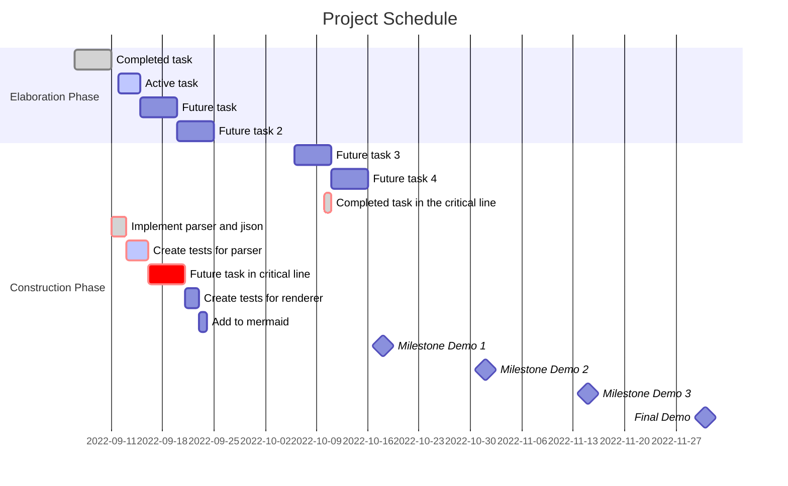

# Software Development Plan   
## Purpose  
The Software Development Plan describes the activities and tasks to be performed to develop the 
software product.  
 
## Requirements 

In addition to the general requirements the Software Development Plan will contain the 
following sections:  

-   Activities - requirements gathering, top-level design, detailed design, test. 
-   Tasks - A task is the performance of an activity leading to a specific feature in a 
product. E.G. Design of unit x. Associated with each task is predecessor tasks (what 
tasks must be complete before this task can start) an estimated effort estimated 
finish data responsible individual successor tasks (what tasks cannon start until this 
task is complete)  
-   Schedule - A graphical layout of the tasks in the form of a Gantt chart. Mark the chart 
for the milestone demos and decide the features shown in each demo. 
-   Development Environment - The required hardware and software to be used to 
develop the project. This includes the selected IDE, compilers, editors, test tools, etc. 
Map the effort of hardware and software setting up as tasks as well and mark your 
chart for the completion of such tasks. 
-   Version Control - The selected version control tool and procedures for maintaining a 
defined master configuration. 

## Example Gantt Chart in MermaidJS

In our Docusaurus project you can add MermaidJS diagrams directly in markdown. Docusaurus will automatically render this markup to the desired chart.
Here is a link to MermaidJS documentation https://mermaid-js.github.io/mermaid/#/gantt.
````
```mermaid
gantt
    YOUR GANTT MARKUP
```
````

<details>

<summary>

Markdown Code for Gantt 

</summary>


````

````

</details>


## Examples of Development Plan Documents 

<p>Example Software Development Plans are here <a class="instructure_file_link instructure_scribd_file inline_disabled" title="V2_Software Development Plan - Temple Cats (1).docx" href="https://templeu.instructure.com/courses/114202/files/19367287?wrap=1" target="_blank" rel="noopener" data-canvas-previewable="false" data-api-endpoint="https://templeu.instructure.com/api/v1/courses/114202/files/19367287" data-api-returntype="File">Best Example Plan - Temple Cats</a>, <a class="instructure_file_link instructure_scribd_file inline_disabled" title="Example SW Development Plan-Fiscal.docx" href="https://templeu.instructure.com/courses/114202/files/19367276?wrap=1" target="_blank" rel="noopener" data-canvas-previewable="false" data-api-endpoint="https://templeu.instructure.com/api/v1/courses/114202/files/19367276" data-api-returntype="File">Example SW Development Plan-Fiscal.docx</a> , <a class="instructure_file_link instructure_scribd_file inline_disabled" title="Example SW Dev Plan - DevOWLCIS.docx" href="https://templeu.instructure.com/courses/114202/files/19367249?wrap=1" target="_blank" rel="noopener" data-canvas-previewable="false" data-api-endpoint="https://templeu.instructure.com/api/v1/courses/114202/files/19367249" data-api-returntype="File">Example SW Dev Plan - DevOWLCIS.docx. </a></p>

