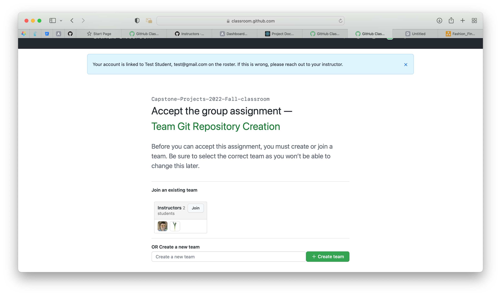
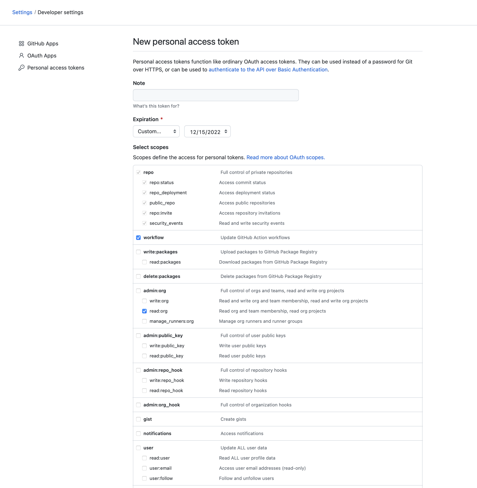
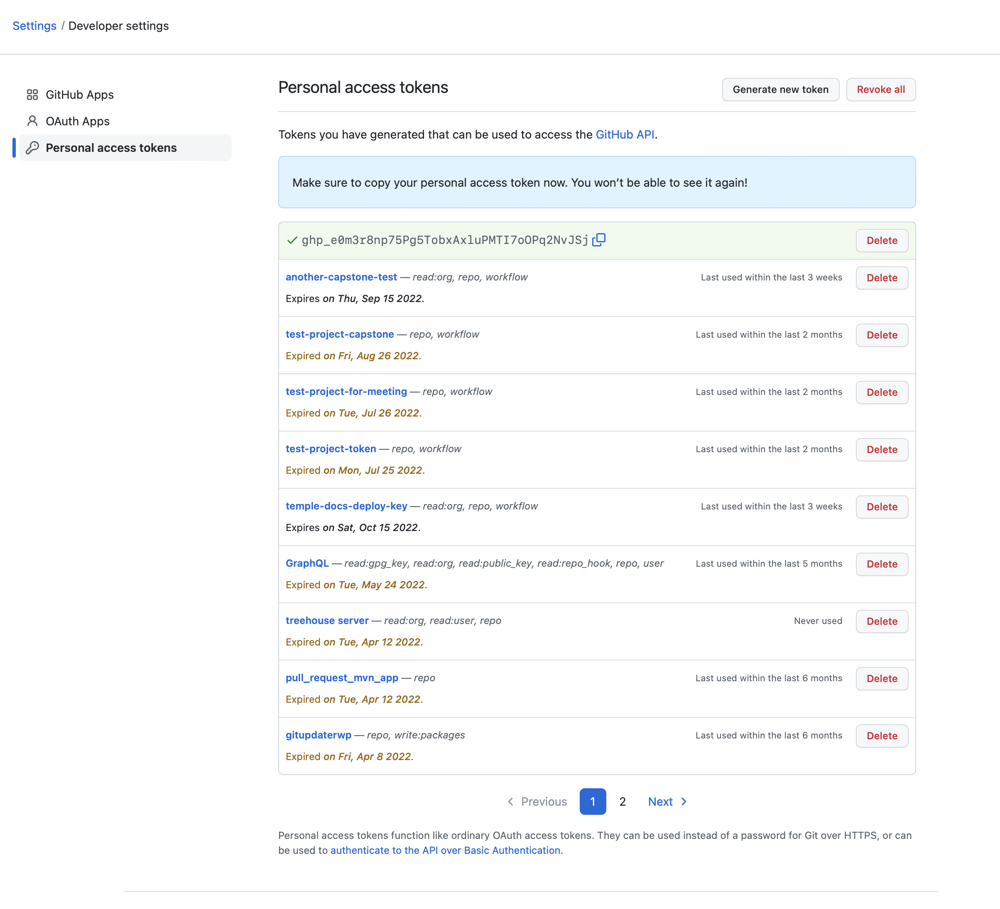
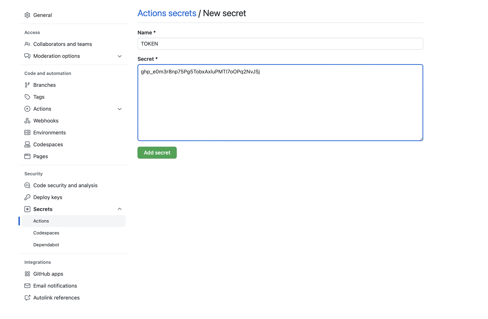
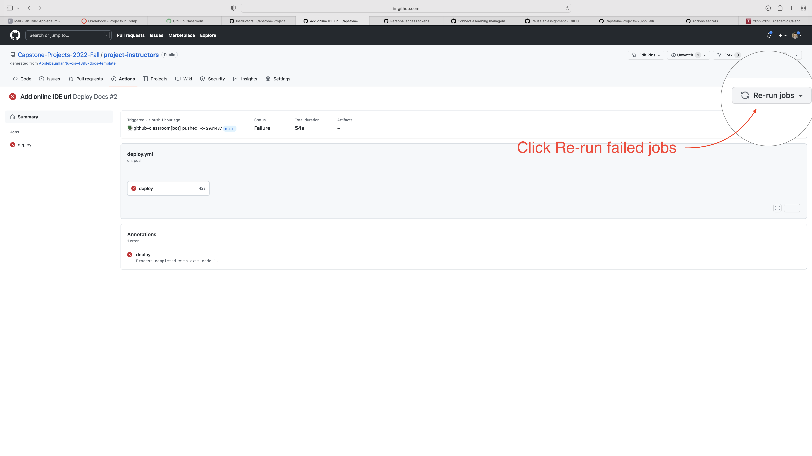
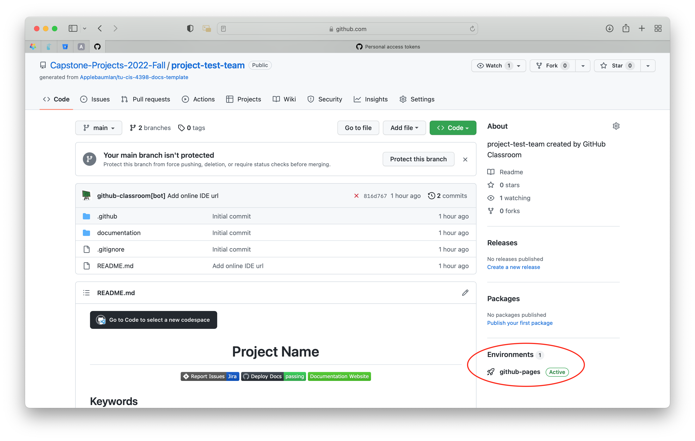
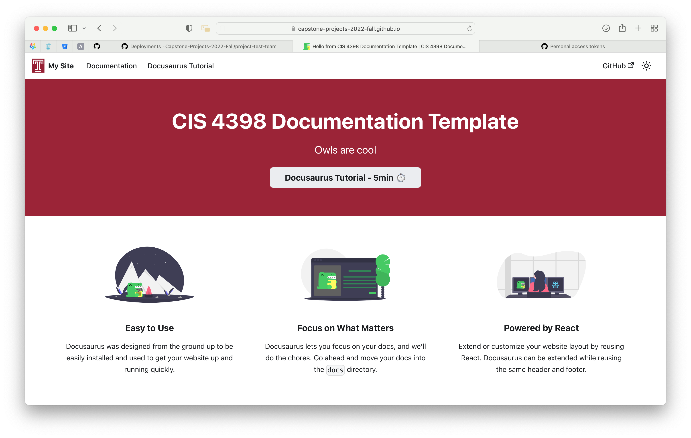

# Project Documentation and Repository

Documentation is a critical part of software projects. Think about it. When you're researching the tools you need for your projects, you're more likely to use the one that has documentation and a community that is actively using it. If you see a project on GitHub with no README file you're likely to just skip it, because you don't even know where to start. Large companies also expect you to document your code, so that management can add more team members when necessary, and so that 20 years down the road, they can maintain it.

Many companies and open source projects are using a tool called Docusaurus, an open source tool for writing and maintaining documentation by Meta. Documentation is written in markdown files in the `documentation/docs/` directory. If you've never written Markdown before, it's incredibly easy.

## Quick Markdown Tutorial

Markdown is just a simple textfile that Docusaurus can interpret and convert into a pretty webpage.

```markdown
# This is a heading 1

## This is a heading 2

### This is a heading 3
```

# This is a heading 1

## This is a heading 2

### This is a heading 3

Heading 2 in Docusuarus appears in the right-hand sidebar as a table of contents with heading 3s as their children. For this class, that should largely be the only thing you need to know unless you want your documentation to look fancier. We will likely play around with some fancy features of docusaurus later in the semester. If you wish to learn more now you can go to the [docusaurus tutorial section](/tutorial/intro) of your documentation website, or go to [Docusaurus.io](https://docusaurus.io/docs/markdown-features) to view Markdown Features.

## Setting up the project

Make sure each team member have their own GitHub account (we recommend you use your personal account for resume building). If you do not have one already create an account at https://github.com/ .

Each team member will get access to the team repo by using this GitHub Classroom link: https://classroom.github.com/a/q3itl4oR (This will automatically associate your Github ID with your Canvas name, create a git repo for your team in the class Github organization and give the instructors and TA access).
The first team member will have to create a team and give it a name. Other teams member will join this team.

1. [Click here to join the GitHub Classroom and get the starter project.](https://classroom.github.com/a/q3itl4oR)
2. Login to your GitHub Account
3. Select your name and TUmail from the list.
4. Select your team or create it if it's not listed.


### GitHub Build Environment Setup

In order for your Documentation Website to build you need to fill a few environment "Secrets" into the project. **ONLY ONE STUDENT HAS TO DO THIS!**

1. Click on your profile picture in the top right corner and click "Settings" in the dropdown.
2. Scroll all the way to the bottom and on the left side click "Devleoper Settings"
3. Click "Personal access tokens" then click "Generate new token" on the right.
4. Select the following privileges and make the expiration date the date of the course end. (This is just for security purposes)

5. Copy your token to clipboard (make sure it's copied because it won't be retrievable when you leave the page.) 
6. Go back to your project repository. Click the settings tab. Now you're going to add the token you copied to the project. Click Secrets under Security > Secrets > Actions. Click new repository secret. Name the secret TOKEN and paste it.

You also need to make one last secret called USER which will contain your GitHub Username.
7. Deploy the website. Start by clicking the Actions Tab. You should see a Workflow called "Deploy Docs" with a failed job called "Add online IDE url". Click the failed job. Click "Re-run jobs" then Re-run failed jobs.

8. Once the job is complete navigate back to your repository's homepage (The Code Tab). You will see an Environments section that says "github-pages" with a 🚀. Click it. Then click "View deployment"

9. Check out your new site!


### Repository and Site Cosmetics

#### Edit the README file
Edit the README.md file at the root of your repository. Include a project overview at the top.


- As a team, make sure to lock the main branch and require reviews for pull requests:
https://docs.github.com/en/github/administering-a-repository/managing-a-branch-protection-rule

- You may as a team decide to make the repo private, consider keeping the repo public (optional). You should note, that your documentation will always be available publicly on GitHub Pages regardless.

## For Submission

This is a group assignment. Submit a link to your newly created repository after all team members have joined.

Grading
This assignment is graded as complete or incomplete. Incomplete submissions will be invited to resubmit until all requirements are met.

